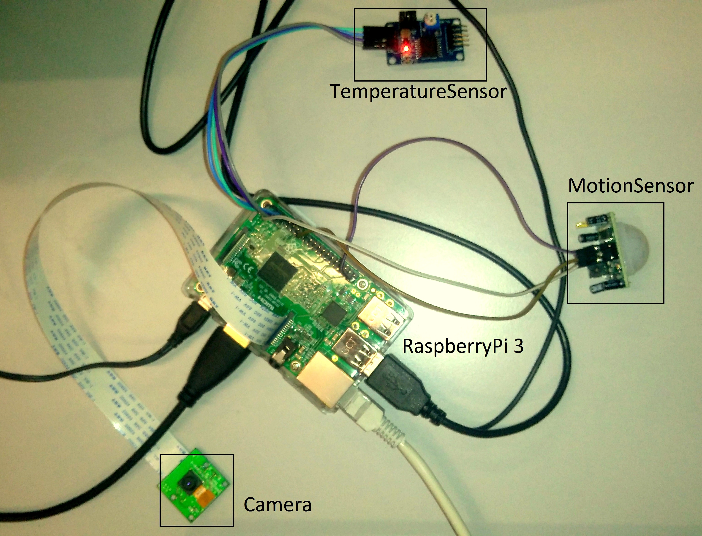
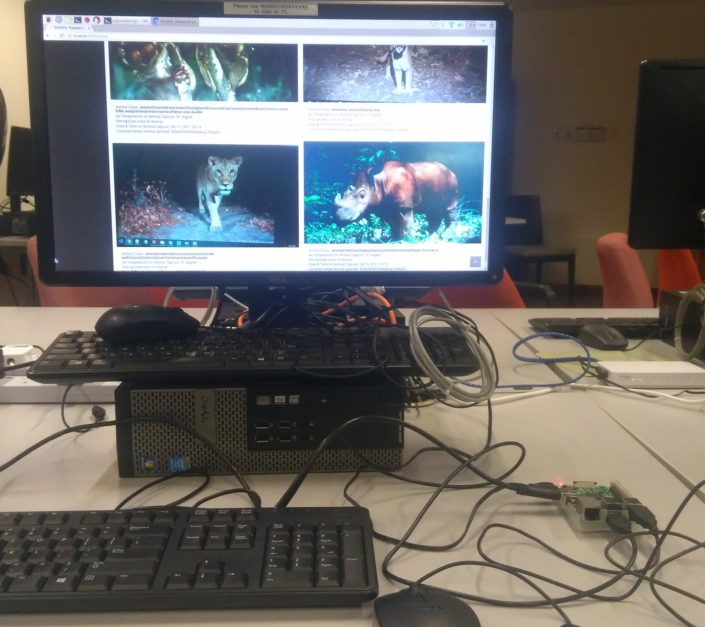
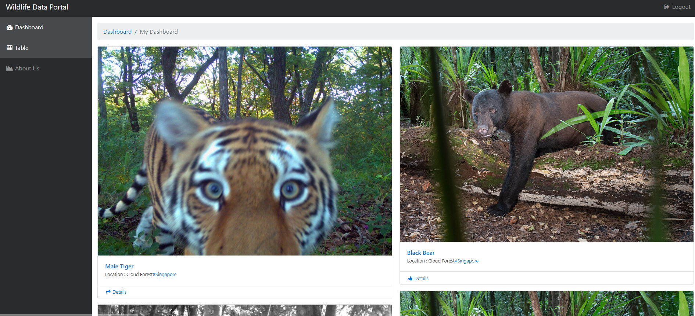
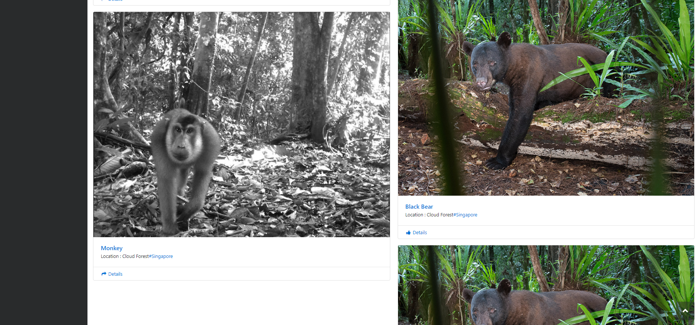

# Wildlife research POC using IOT(Internet of things):

## Objective:

The aim of the project is to collect wildlife animal data using IOT devices and use it for research

to monitor migration pattern of various wildlife species and their habitat etc.

## Hardware Requirements:

- Raspberry pi 3

- Motion Sensor

- Camera

- Temperature Sensor

- LCD Display

## Software Technologies:

- HTML5 and CSS

- MYSQL DB

- Python 3, Django

## Description:

Basic idea of project is to use IOT technology to research on wild animal habitats.

Wildlife animals can be detected by using **motion sensor** attached to **Raspberry pi**. Once motion is detected **camera attached** to raspberry pi will take picture of the animal and send this picture to **image recognition API**. Image recognition API will analyze this image and give output in the form of JSON data from which animal information can be extracted. Also, it will note date, time and weather conditions when animal is detected.

All this data will be stored in **MYSQL database hosted on difference server** for the analysis and research. Application will have **front-end using HTML5, CSS** which will show history of all animals captured using camera.

## Hardware setup looks like this:

> 

## Some demo screenshots:

> 

- #### Data portal UI:

  > 

  > 

## References:

- Image Recognition: https://visual-recognition-demo.mybluemix.net/
